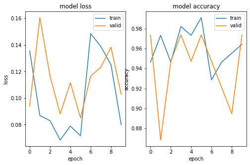

## Portfolio

---

### DATA SCIENCE 
***
### Classification Google Play Store Rating with Naïve Bayes, Random Forest and K-Means Using R

In this project I am going to perform comprehensive EDA on Google Play Store Rating dataset, then clasify the data using Naïve Bayes, Random Forest dan K-Means model to see accuracy classfication based on Price, Review, Size, and Installs.

 

---
### Analysis Iris Dataset with Neural Network using Python

In this project I am going to perform classify iris data based on variable sepal and petal sizes using Neural Network, then make a prediction with the accuracy around 97%.

 

 

---
[Project 2 Title](/pdf/sample_presentation.pdf)

---
[Project 3 Title](http://example.com/)

---

### Category Name 2

- [Project 1 Title](http://example.com/)
- [Project 2 Title](http://example.com/)
- [Project 3 Title](http://example.com/)
- [Project 4 Title](http://example.com/)
- [Project 5 Title](http://example.com/)

---

---

Page template forked from <a href="https://github.com/evanca/quick-portfolio">evanca</a>

<!-- Remove above link if you don't want to attibute -->
